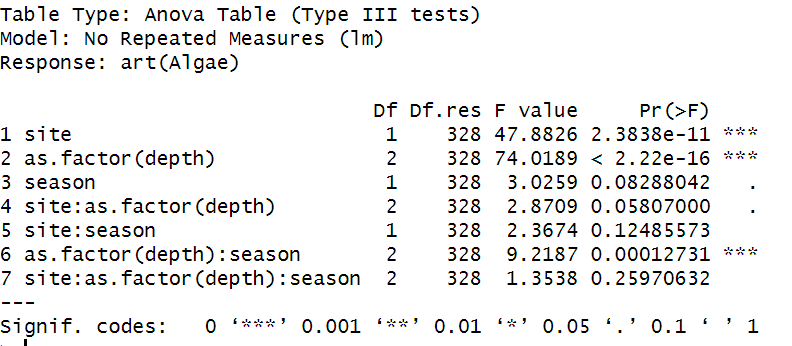

# **Data Analysis**

## **Data from the Photo-Survey of Benthic Biota across Two Transects of the Eastern Mediterranean Continental Shelf**

I began by loading and examining the contents of the two provided CSV files. This step was crucial for understanding the data structure and planning the subsequent analysis. The metadata file contains details about each transect, including site, depth, season, and transect ID, while the processed data file includes percentage coverage values for different taxonomic groups in each transect.

## **Steps Taken:**

 ### **1.	Selection of taxonomic group:** 
 I chose algae for analysis.
 ### **2.	Analysis of algae coverage:**
 Respect to site, season, and seafloor depth.  
 Interaction with other taxonomic groups.

 ## **Starting with the first step, that is, analyzing algae coverage with respect to the three main variables.**

 1.	I merged the metadata and processed data on the transect ID.
 2.	I performed descriptive statistics and visualized the data (figure 1).
 3.	I conducted statistical tests to analyze the effects of site, season, and seafloor depth on algae coverage.

 ## **The descriptive statistics for algae coverage are as follows:**

 Count=340 samples, mean =43.27%, standard deviation=24.19%, minimum=0.48%, 25th percentile=21.80%, 50th percentile=45.85%, 75th percentile=62.50%, and maximum=92.79%.

 ## **ANOVA results**

 Next, I performed statistical tests to determine if the 3 variables have significant effects on algae coverage as shown in figure 2. I used ANOVA since the data have multiple groups for each variable. The ANOVA test indicated that algae coverage varies significantly with site and seafloor depth, but not with season.

Figure 1: Boxplots showing how algae coverage varies by site, season, and seafloor depth

Figure 2: ANOVA results showing the effects of site, season, and seafloor depth on algae coverage

## **Differences Between the Samplers**

To check for differences in algae coverage between the two samplers, I conducted an additional test. The results showed no significant difference (p-value = 0.408) between the two samplers (figure 3).

Figure 3: Boxplot of algae coverage between the two samplers

## **Interaction Analysis**

I examined the interaction between algae coverage and another taxonomic group, Bryozoa. The correlation between algae and Bryozoa was visualized using a scatter plot (figure 4). I transformed the square matrix to a log format and adjusted the p-value using the Benjamini-Hochberg (BH) method. I downloaded an output file name “Taxonomic_groups_spearman”.

.png)

Figure 4: Spearman correlation between algae and Bryozoa

